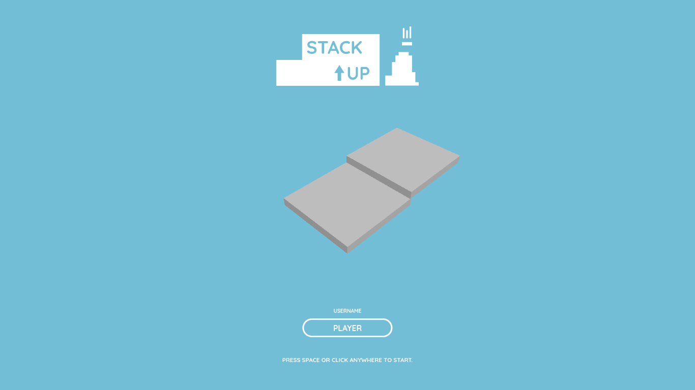

# Stack Up

This 3D game is all about stacking! Stack your way up and climb the leaderboard!

## How to play

As the name implies, your goal is to stack the most number of blocks perfectly without any blocks hanging off. If the block hangs off, the size of the next block will be reduced.

To stack a block, simply click anywhere on the screen or press the spacebar on your keyboard.

For every successful stack, you will add 1 point to your score. But if you manage to stack perfectly, you will earn an additional 2 points.

## Libraries used

* [Three.js](https://threejs.org/) (3D rendering library)
* [jQuery](https://jquery.com/) (UI framework)
* [Supabase](https://supabase.com/) (database)
